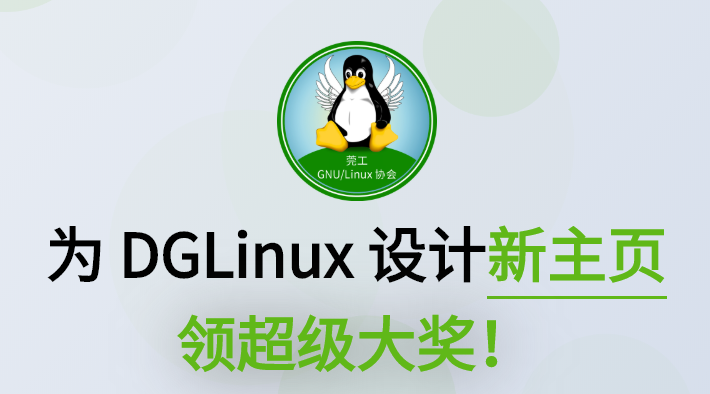
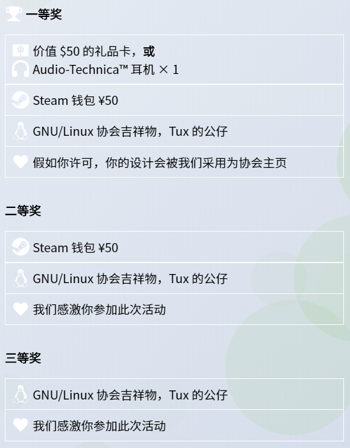

**主题：**

**为DGLinux设计新主页大赛**

**比赛流程：**

4月25日—5月05日：接收提交作品

5月05日—5月07日：协会评选作品

评选结束后，随即公示评选结果

（活动无需报名）

**设计要求：**

你需要设计两个界面：**[协会主页(index.html)](https://linux.dgut.edu.cn/)**和**[协会博客页(blog.html)](https://linux.dgut.edu.cn/blog.html)**，可在[活动主页](https://linux.dgut.edu.cn/design/)进入协会主页进行查看。

> 协会首页可以非常简洁，也可以加适当说明协会的性质。作为协会的入口，我们鼓励你设计出轻快，明了的感觉。另一方面，首页也可以作为内容入口，展示我们以往的推文。

> 协会博客页通常会有内容和干货。在里面，要记录文章作者、文章分类、发布日期、和永久链接。

> （活动主页提供简单示例和协会logo）

当然，本次活动**杜绝抄袭**，我们鼓励任意形式的创作，抄袭是指跟其他网站设计几乎一模一样的设计。当然，Material Design 等设计流派不在抄袭的范畴内。

就这样，我们对设计本身的要求非常低，所以放开你的想象力来设计吧！我们同时也接受你使用任意框架/库，Bootstrap, AngularJS, Vue.js, React, Reason......

**作品提交：**

开放提交期间可在[活动主页](https://linux.dgut.edu.cn/design/)进行提交，除作品外最好包含readme文档，写下个人信息联系方式等。

**奖品一览：**

---

[点击查看更多活动事项](https://linux.dgut.edu.cn/design/)

超级大奖

等着你来拿！！！

Bye